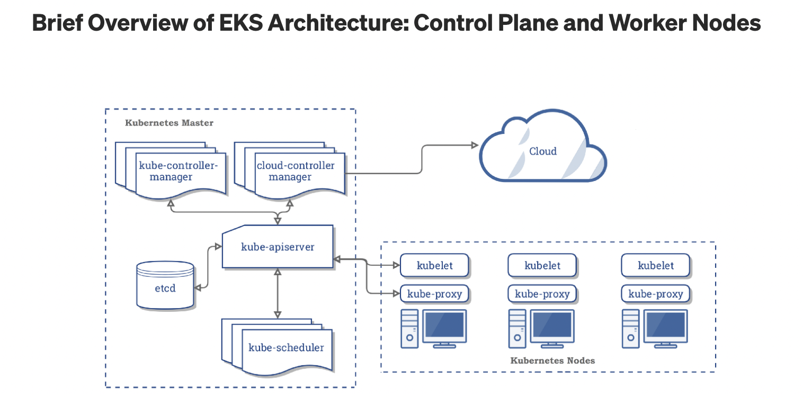

# AWS EKS 
- Every EKS cluster has two infrastructure components no matter what option you pick (even serverless):
  + the EKS Control Plane (also known as the “EKS Cluster” in the AWS Console)
    - API server: provides the main UX for interacting with the cluster
    - When you interact with Kubernetes, you schedule workloads by applying manifest files to the API server
    -eg `kubectl -f apply <MANIFEST.yml>`
    - The Master components then schedule the workload on any available worker node in the cluster, and monitor it for the duration of its lifetime
  + Worker Nodes

### EKS cluster: [CloudPosse](https://github.com/cloudposse/terraform-aws-eks-cluster)
- the objective of the project is to create a full-blown EKS cluster that can host a kubernetes application
- The CloudPossee EKS module will provision the following resources:
  + EKS cluster of master nodes
  + IAM Role to allow the cluster to access other AWS services
  + Security Group which is used by EKS works to connect to the cluster and kubelets and pods to recieve communication from the cluster controle plane
  + the module creates and automicially applies an authentication ConfigMap to allow the worker nodes to join the cluster and to add additional users/roles/accounts

## links
- https://blog.gruntwork.io/comprehensive-guide-to-eks-worker-nodes-94e241092cbe
- https://kubernetes.io/docs/concepts/overview/components/